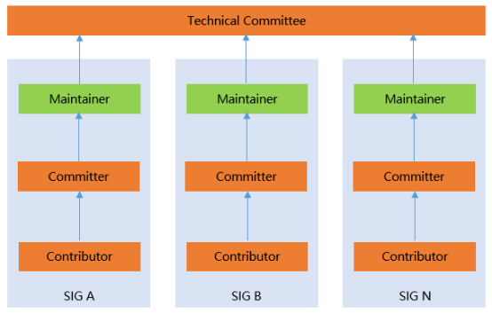

# tc

openGauss开源社区技术委员会（Technical Committee，简称TC）是openGauss社区项目的技术管理机构，提供技术指导、决策和监督。

### 技术委员会主要职责

技术委员会是社区的技术领导机构，其主要职权是：

* 技术委员会拥有技术决策的最终裁决权。
* 决策社区技术的发展愿景和方向。
* 决策社区 SIG 的成立、撤销、合并等事务。解决 SIG 组之间的协作冲突，辅导、审视和监督 SIG 组的日常运作。
* 落实社区日常开发工作，保证 openGauss 社区发行版高质量发布。
* 引导社区在体系架构、内核、安全、AI、云原生等领域技术创新，保证社区具有持续的技术竞争力。
* 引导社区建立原创性开源项目，持续构建社区技术影响力。

### 技术员委员会成员

技术委员会设主席 1 名，主席的职权是：

* 召集和主持技术委员会会议，并保证参会人员有充分表达技术意见的权利。
* 在各类会议、活动中代表社区进行宣传。
* 主席同时是技术委员会委员，拥有和其他委员相同的投票权利。

openGauss开源社区TC主席及成员，由openGauss社区任命，包含对openGauss社区做出重大贡献并愿意持续投入的人员。当前TC成员包括：

* 李国良[[@guoliang_li](https://gitee.com/guoliang_li)]    # 主席
* 田文罡[[@pikeTWG](https://gitee.com/pikeTWG)]
* 李士福[[@lishifu_db](https://gitee.com/lishifu_db)]
* 贺承汉[[@he-chenghan](https://gitee.com/he-chenghan)]
* 任阳[[@stanleyren](https://gitee.com/stanleyren)]
* 朱彬[[@/Yoota_zhu](https://gitee.com//Yoota_zhu)]
* 周平高[[@zankyfun4](https://gitee.com/zankyfun4)]
* 王江[[@wang-jingle](https://gitee.com/wang-jingle)]
* 孙佶[[@greatjigreatji](https://gitee.com/greatjigreatji)]
* 王炜[[@wangwei5](https://gitee.com/wangwei5)]
* 关刚[[@guangang1981](https://gitee.com/guangang1981)]
* 张程伟[[@jarekzhang](https://gitee.com/jarekzhang)]
* 刘勇生[[@lys6676](https://gitee.com/lys6676)]
* 周芹[[@zhouqinsm](https://gitee.com/zhouqinsm)]
* 朱彬[[@zzzzzdb](https://gitee.com/zzzzzdb)]
* 杨维强[[@yangweiqiang](https://gitee.com/yangweiqiang)]
* 朱金伟[[@zhu_jinwei](https://gitee.com/zhu_jinwei)]
* 柴鹏[[@chaip3](https://gitee.com/chaip3)]
* 王磊[[@nonolili527](https://gitee.com/nonolili527)]
* 吴明远[[@wmy_ld](https://gitee.com/wmy_ld)]

为保障技术委员会的运作，可强制离任连续2次不参加TC会议的委员；TC成员因个人原因申请离任的，应通知全体TC成员。

### 技术委员会会议召开与决策机制

技术委员会每两周召开技术委员会例会，或二分之一以上委员提议召开临时会议。

* 技术委员会会议由主席在会议召开前 5 个自然日通过邮件在邮件列表通知全体委员，会议通知应当包括召开的地点、日期、时间、方式和会议议题以及可用的参考来源，以便委员对会议内容获取相关信息进行准备。会议为公开会议，任何社区成员都可以参加会议，表达技术观点但无投票权利。
* 技术委员会会议须有三分之二以上（含）的委员出席为有效会议。
* 所有决议均需要在有效的例会进行投票表决，投票为公开记名投票。投票分为赞同票、反对票和弃权票，只有三分之二以上（含）的与会委员且超过全体委员会的二分之一投赞同票，决议才能通过，未到场委员不能委托其他人代替投票。
* 技术委员会会议讨论未尽的事宜，可在技术委员会公开邮件列表通过邮件继续讨论。主席可通过邮件列表发起邮件投票，投票发起后委员需要在邮件发出后第 2 日起的 5 个自然日内回复邮件进行投票，逾期默认为投弃权票。

### 技术委员会联系方式

* 邮件列表：tc@opengauss.org
* 会议时间：北京时间 每月一次 ，请订阅邮件列表收取更多TC信息，https://mailweb.opengauss.org/postorius/lists/tc@opengauss.org/
