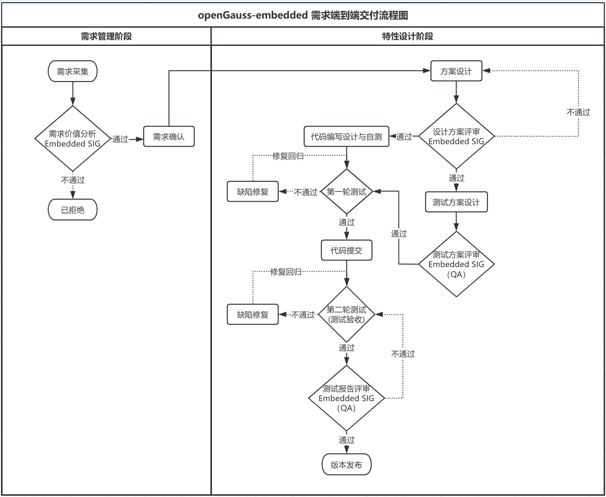

# Embedded SIG

**Embedded SIG** 聚焦于工业多模嵌入式数据库的开发，环境适配，运维和版本发行。致力于打造一个轻量化，多模态（含关系型，时序型，KV型），高性能，广泛兼容国内外各种OS的嵌入式工业数据库。其职责包括但不限于：

**需求及需求规划评审：** 包括需求的合理性与紧急性、对整体系统的影响、完整性与清晰度、可实施性等因素，确保需求符合项目的愿景和目标。

**技术方案评审：** 包括新功能的设计方案、架构优化方案等，结合技术的可行性、实现成本、对系统性能的影响等维度，确保方案符合项目的技术路线和标准。

**测试方案评审：** 包括功能测试、性能测试、安全测试等，确保测试覆盖全面、测试方法有效、测试结果可靠，保证质量符合标准。

**版本维护：** 包括 issue 跟踪、功能建议等，确保社区问题得到及时响应与有效解决。

## 1 SIG成员

### 1.1 Maintainer列表

- 刘保玉[@borisfly](https://gitee.com/borisfly), *liubaoyu@ncti-gba.cn*
- 吴峰[@aiminralph](https://gitee.com/aiminralph), *wufeng@ncti-gba.cn*
- 阙鸣健[@quemingjian](https://gitee.com/Mijamind), *quemingjian2@huawei.com*

### 1.2 Committer列表

- 窦欣[@ywzq1161327784](https://gitee.com/ywzq1161327784), *xdou1995@163.com*
- 申正[@shenzheng4](https://gitee.com/shenzheng4), *shenzheng4@huawei.com*
- 李振[@lizhen29](https://gitee.com/lizhen29), *lizhen@ncti-gba.cn*
- 孙天飞[@telebby](https://gitee.com/telebby), *suntianfei@ncti-gba.cn*
- 李玉祥[@zxccxz](https://gitee.com/zxccxz), *liyuxiang@ncti-gba.cn*
- 蔡文艺[@vanbars](https://gitee.com/vanbars), *caiwenyi@ncti-gba.cn*
- 杨子浩[@Louisyzh](https://gitee.com/Louisyzh), *yangzihao@ncti-gba.cn*
- 曾色亮[@zengseliang](https://gitee.com/zengseliang), *zengseliang@ncti-gba.cn* **| Embedded SIG运营**

## 2 仓库清单

- **代码地址：** https://gitee.com/opengauss/openGauss-embedded
- **Embedded SIG：** https://gitee.com/zengseliang/tc/blob/master/sigs/Embedded/README.md

## 3 邮件订阅

openGauss社区使用邮件列表进行线上沟通交流，订阅Embedded SIG邮件后可接收会议通知等信息，或在openGauss官网首页-社区会议查看，如需了解Embedded SIG更多相关信息，可联系Embedded SIG运营加入Embedded SIG交流群。

- **邮件列表订阅链接：** https://mailweb.opengauss.org/postorius/lists/embedded.opengauss.org/

- **邮件列表订阅指导：** https://www.opengauss.org/zh/community/onlineCommunication/

  

## 4 会议时间

欢迎大家参加Embedded SIG会议，如需申报议题，请在下方链接中新增并提前准备好交流/评审材料。

- **公开会议时间：** 北京时间 每双周五 11:00-12:00
- **会议召开周期：** 视议题而定 | 若会议前一天无议题申报，会议推迟一周；若议题较多时将适时调整或加开
- **相关与会人员：** Embedded SIG成员、生态伙伴、用户
- **议题申报链接：** https://etherpad.opengauss.org/p/Embedded-meetings
- **会议预订地址：** https://opengauss.org/zh/ **| 由Embedded SIG特定的Maintainer/committer预订会议**
- **纪要归档地址：** https://mailweb.opengauss.org/hyperkitty/list/embedded@opengauss.org/

## 5 **需求端到端交付流程**

### 5.1 流程图

### 5.2 流程说明

#### 5.2.1 **需求管理阶段**

##### 5.2.1.1 需求采集

由需求发起者在[openGauss-embedded仓通过新建issue](https://gitee.com/opengauss/openGauss-embedded/issues/new?issue%5Bassignee_id%5D=0&issue%5Bmilestone_id%5D=0)录入，在面板中需要提供详细的使用场景说明和规格要求，并在Embedded SIG申报议题，需上会说明需求的必要性。需求来源包括但不限于外部开发者、社区合作伙伴等所录入的需求或者缺陷、项目版本负责人在各版本启动前期所规划的需求等。

##### 5.2.1.2 **需求价值分析**

 由Embedded SIG的Maintainer/Committer进行需求价值分析，识别高价值需求，给出需求价值结论。评估范围包括但不限于需求的合理性与紧急性、对整体系统的影响、完整性与清晰度、可实施性等。

##### 5.2.1.3 需求确认

由项目版本负责人提供需求交付工作量评估并指定研发负责人，结合评估结果在到[社区版本管理平台](https://e.gitee.com/opengaussorg/projects?project%5Bstatus%5D=0)（若需开通平台权限可联系[RM SIG](https://gitee.com/zengseliang/tc/blob/master/sigs/ReleaseManagement/README.md)）对需求进行版本划分，并于版本前期在RM SIG申报议题，需上会说明该版本对应的需求。RM SIG邮件订阅流程可参考文中 **邮件订阅 - 邮件列表订阅指导**。

#### 5.2.2 **特性交付阶段**

由项目负责人实时更新定时[社区版本管理平台](https://e.gitee.com/opengaussorg/projects?project%5Bstatus%5D=0)对应版本的issue状态，并定时参加RM SIG会议同步特性交付进度。RM SIG邮件订阅流程可参考文中 **邮件订阅 - 邮件列表订阅指导**。

##### 5.2.2.1 **方案设计**

由研发负责人输出方案设计文档，并在Embedded SIG申报议题，需上会讲解设计方案，此时项目版本负责人需将issue状态变更为“设计方案评审”。

##### 5.2.2.2 **设计方案评审**

由Embedded SIG的Maintainer/Committer对处于“设计方案评审”状态的issue进行评审，评审通过后需求进入测试方案设计阶段和代码编写阶段。研发负责人把评审通过的会议纪要、遗留问题闭环结论、方案设计文档、需求设计文档，邮件知会项目版本负责人，此时项目版本负责人需将对应issue状态变更为“测试方案设计”阶段，并将文档添加到issue附件中。

##### 5.2.2.3 **测试方案设计**

由测试负责人输出测试方案与用例设计文档，并在Embedded SIG申报议题，需上会讲解设计方案，此时项目版本负责人需将对应issue状态变更为“测试方案评审”。

##### 5.2.2.4 **测试方案评审**

由Embedded SIG的Maintainer/Committer和[QA SIG](https://gitee.com/zengseliang/tc/blob/master/sigs/QA/README.md)的Maintainer/Committer（Embedded SIG运营通知[QA SIG](https://gitee.com/zengseliang/tc/blob/master/sigs/QA/README.md) 成员上会）对处于“测试方案评审”状态的issue进行评审，测试负责人把评审通过的会议纪要、遗留问题闭环结论、测试方案文档，邮件知会项目版本负责人，此时项目版本负责人需将对应issue状态变更为“代码编写与自测”阶段，并将文档添加到issue附件中。

##### 5.2.2.5 **代码编写与自测**

由研发负责人按照社区代码编写格式和提交要求完成代码输出和自验，并提交提测文档，邮件知会测试负责人。满足提测条件后，研发负责人邮件知会项目版本负责人，需求进入第一轮测试阶段。

##### 5.2.2.6 **第一轮测试**

由测试负责人结合测试方案执行测试用例，执行第一轮测试，输出测试报告，邮件知会研发负责人、项目版本负责人。研发负责人需提交对应的PR，同时建立PR与issue的关联关系。此时项目版本负责人需将对应issue状态变更为“代码检视”阶段。

##### 5.2.2.7 **代码提交**

由Embedded SIG的Maintainer/Committer对处于“代码检视”阶段的PR开展代码检视，代码检视要在一周内完成检视和检视意见提交。所有检视意见闭环后，Embedded SIG组Maintainer/committer合入PR到社区，设置关联issue状态为“测试验收”，研发责任人邮件知会测试负责人开展测试用例执行和需求验收。

##### 5.2.2.8 **第二轮测试 / 测试验收**

由测试负责人结合测试方案执行测试用例，针对测试发现的阻塞类型完成修复回归后，输出测试报告，并在Embedded SIG申报议题，需上会说明测试情况。

##### 5.2.2.9 **测试报告评审**

由Embedded SIG的Maintainer/Committer和[QA SIG](https://gitee.com/zengseliang/tc/blob/master/sigs/QA/README.md)的Maintainer/Committer（Embedded SIG运营通知[QA SIG](https://gitee.com/zengseliang/tc/blob/master/sigs/QA/README.md) 成员上会）对处于“测试验收”状态的issue对应的测试报告进行评审，测试负责人把评审通过的会议纪要、遗留问题闭环结论、测试报告，邮件知会项目版本负责人，此时项目版本负责人需将issue状态变更为“已完成”阶段，并将文档添加到issue附件中。

##### 5.2.2.10 **版本发布**

由RM SIG（待定）在版本节点基于主分支构建二进制包对外发布。

### 6 openGauss版本管理

#### 6.1 **版本声明周期管理**

 https://gitee.com/opengauss/release-management/blob/master/openGauss%E7%89%88%E6%9C%AC%E7%94%9F%E5%91%BD%E5%91%A8%E6%9C%9F%E7%AE%A1%E7%90%86.md

#### 6.2 版本生命周期公告

https://gitee.com/opengauss/release-management/blob/master/openGauss%E7%A4%BE%E5%8C%BA%E7%89%88%E6%9C%AC%E7%94%9F%E5%91%BD%E5%91%A8%E6%9C%9F%E5%85%AC%E5%91%8A.md

### 7 openGauss测试模板

#### **7.1 特性测试报告模板**

[https://gitee.com/opengauss/QA/blob/master/Test_Delivery_Templates/openGauss%20XX%E7%89%88%E6%9C%ACXX%E7%89%B9%E6%80%A7%E6%B5%8B%E8%AF%95%E6%8A%A5%E5%91%8A%E6%A8%A1%E6%9D%BF.md](https://gitee.com/opengauss/QA/blob/master/Test_Delivery_Templates/openGauss XX版本XX特性测试报告模板.md)

#### **7.2 版本测试报告模板**

[https://gitee.com/opengauss/QA/blob/master/Test_Delivery_Templates/openGauss%20XX%E7%89%88%E6%9C%AC%E6%B5%8B%E8%AF%95%E6%8A%A5%E5%91%8A%E6%A8%A1%E6%9D%BF.md](https://gitee.com/opengauss/QA/blob/master/Test_Delivery_Templates/openGauss XX版本测试报告模板.md)

#### 7.3 **版本测试策略模板**

[https://gitee.com/opengauss/QA/blob/master/Test_Delivery_Templates/openGauss%20XX%E7%89%88%E6%9C%AC%E6%B5%8B%E8%AF%95%E7%AD%96%E7%95%A5%E6%A8%A1%E6%9D%BF.md](https://gitee.com/opengauss/QA/blob/master/Test_Delivery_Templates/openGauss XX版本测试策略模板.md)

